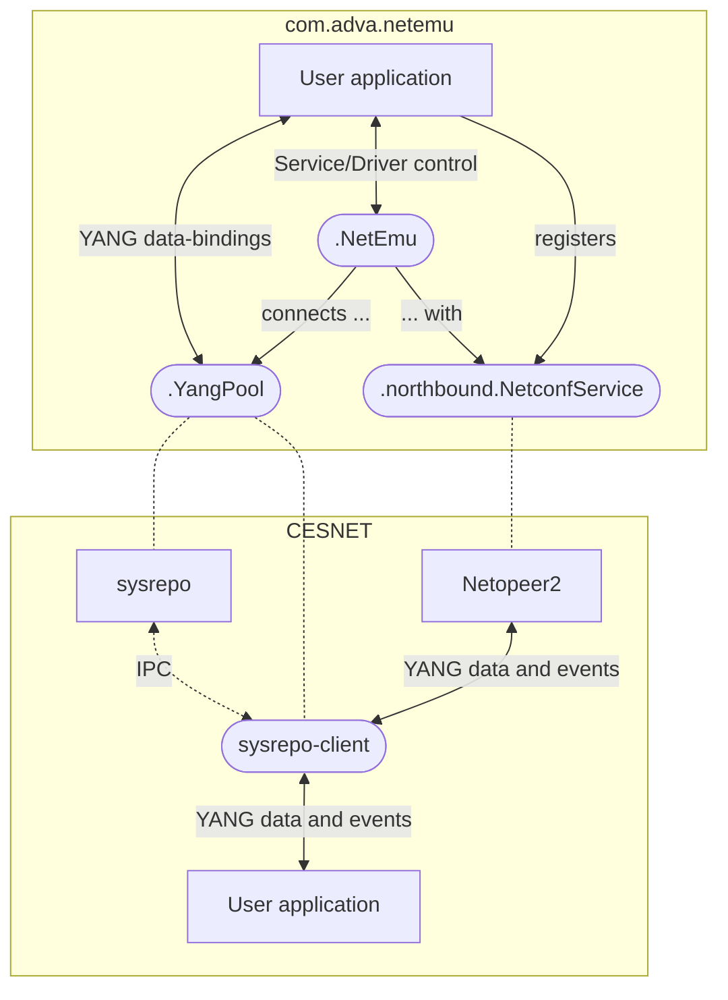

NETEMU
======

[](https://adtran.com)
> **NE**tworking **T**echnologies' **E**nhanced **M**anagement **U**tilities

[Advanced](https://adtran.com/en/about-us/advanced-technology) Java/YANG **Rapid Development Framework** for **Lightweight SDN Applications**, featuring:

* [OpenDaylight](https://opendaylight.org)-libraries at its core
* MD-SAL/Advanced code generation, defined by YANG models, controlled by Java annotations
* Clean, declarative, event-based, functional, asynchronous Java APIs for `@YangBound` data flow
* [CPython](https://python.org)-integration via [Jep](https://pypi.org/project/jep) for interactive data analysis and automation scripting, including support for [Jupyter](https://jupyter.org) notebooks
* [React/Native](https://reactnative.dev)-integration, targeting [Expo](https://expo.io), for Android, iOS, and Web cross-platform frontend development
* Completely [Gradle](https://gradle.org)-managed application life-cycles

### Prepare your development environment for NETEMU

Make sure to have JDK 17 or 19, Gradle 8.4+, [Groovy](https://groovy-lang.org) 4.0+, and [Maven](https://maven.apache.org) 3.8+ installed. Recommended installation sources are:

* **GNU/Linux**: Your GNU/Linux distribution's package manager or [SDKMAN!](https://sdkman.io)
* **Mac OSX**: [Homebrew](https://brew.sh) or [SDKMAN!](https://sdkman.io)
* **Windows**: [Chocolatey](https://chocolatey.org)

> NETEMU DOES NOT fully work with Java 20+ yet

[Intellij IDEA](https://jetbrains.com/idea) is NETEMU's preferred IDE. It has great Gradle integration, and its auto-completion works fast and smoothly with dynamic MD-SAL/Advanced code generation.

> IF YOU PREFER OR PARALLELLY USE a terminal shell for managing your project, you should open a new terminal now and check your compiler and build tool versions again:

* ```shell
  > java -version
  openjdk version "17" ...
  ...
  ```

* ```shell
  > gradle -version
  ------------------------------------------------------------
  Gradle 8.4
  ------------------------------------------------------------
  ...
  ```

* ```shell
  > groovy -version
  Groovy Version: 4.0.15 ...
  ```

* ```shell
  > mvn -version
  Apache Maven 3.9.5 ...
  ...
  ```

> IF ANY `-version` output differs from what you expect, if it shows older, previously installed versions of a tool or of the Java installation it uses, the reason is usually one or more of the following:

* The shell environment of a package manager was not properly activated
* The `PATH` environment variable was not properly updated by an installer
* The `JAVA_HOME` environment variable points to another Java installation

### Setup your local NETEMU

Clone NETEMU's Git repository including its Git submodules. This will automatically clone along ADVAnced forks of OpenDaylight Git repositories to respective `opendaylight-*/` sub-folders and checkout their `adva/master` branches.

> IN A TERMINAL, this means running `git clone` with `--recurse-submodules` flag:

* ```shell
  > git clone git@github.com:advaoptical/netemu.git --recurse-submodules
  Cloning into 'netemu'...
  ...
  Cloning into '.../netemu/opendaylight-mdsal'...
  Cloning into '.../netemu/opendaylight-netconf'...
  Cloning into '.../netemu/opendaylight-yangtools'...
  ...
  Submodule path 'opendaylight-mdsal': checked out '...'
  Submodule path 'opendaylight-netconf': checked out '...'
  Submodule path 'opendaylight-yangtools': checked out '...'
  ```

> IF YOU FORGOT the `--recurse-submodules` flag, then you run the following from inside your cloned `netemu` repository's root directory:

* ```shell
  path/to/netemu> git submodule update --init --recursive
  ...
  Cloning into '.../opendaylight-mdsal'...
  Cloning into '.../opendaylight-netconf'...
  Cloning into '.../opendaylight-yangtools'...
  ...
  Submodule path 'opendaylight-mdsal': checked out '...'
  Submodule path 'opendaylight-netconf': checked out '...'
  Submodule path 'opendaylight-yangtools': checked out '...'
  ```

NETEMU requires slight Advancements in some method implementations of a few OpenDaylight modules. Hence the forked repositories, which add `_x-ADVA` suffixes to their version numbers. These must be installed first, using Gradle task `:mvnInstallOpenDaylightModules` (_shortcut_ `mIODM`).

> IN A TERMINAL, this must again be run from inside your `netemu` root directory:

* ```shell
  path/to/netemu> gradle mvnInstallOpenDaylightModules

  Task :mvnInstallYangtools
  [INFO] Scanning for projects...
  ...
  [INFO] Building yangtools-artifacts 9.0.5_1-ADVA
  ...

  Task :mvnInstallMdsal
  [INFO] Scanning for projects...
  ...
  [INFO] Building mdsal-artifacts 10.0.5_1-ADVA
  ...

  Task :mvnInstallNetconf
  [INFO] Scanning for projects...
  ...
  [INFO] Building netconf-artifacts 4.0.4_1-ADVA
  ...
  ```

Then, the main `com.adva:netemu` Java package is installable with Gradle task `:publishToMavenLocal` (_shortcut_ `pTML`) provided by [Maven Publish Plugin](https://docs.gradle.org/current/userguide/publishing_maven.html).

> IN A TERMINAL, this means once more running `gradle` from inside your `netemu` root directory:

* ```shell
  path/to/netmeu> gradle publishToMavenLocal

  Task :compileJava
  ...

  Task :publishPluginMavenPublicationToMavenLocal
  ...

  BUILD SUCCESSFUL in ...
  13 actionable tasks: * executed, * up-to-date
  ```

Now, everything is ready for starting your first EMU-Project; or building, running, and contributing to existing EMU-Projects!

### Before you start coding... a quick NETMEU API overview


**Services** are derived from abstract `com.adva.netemu.service.EmuService`. Predefined are:

* `com.adva.netemu.northbound.NetconfService` - Based on [OpenDaylight-netconf](https://github.com/opendaylight/netconf/tree/master/netconf)
* `com.adva.netemu.northbound.RestconfService` - Based on [OpenDaylight-restconf](https://github.com/opendaylight/netconf/tree/master/restconf) and [Grizzly](https://javaee.github.io/grizzly)

**Python** services are derived from abstract `com.adva.netemu.service.EmuPythonService` - Based on [Jep](https://pypi.org/project/jep); derived from `.EmuService`. Predefined is:

* `com.adva.netemu.northbound.PythonKernelService` - Using [IPython Kernel for Jupyter](https://github.com/ipython/ipykernel)

**Drivers** are derived from abstract `com.adva.netemu.driver.EmuDriver`. Predefined is:

* `com.adva.netemu.southbound.NetconfDriver` - Based on OpenDaylight-netconf

### If you come from Netopeer2/sysrepo... or don't

NETEMU's API design draws heavily from the modular structure of [CESNET's C libraries and tools](https://github.com/cesnet) for NETCONF/YANG application development, whose main components are:

* [sysrepo](https://github.com/sysrepo) - A central YANG datastore and module repository service
* sysrepo-client - A library for developing applications that communicate over sockets with sysrepo service, enabling them to read from and write to YANG datastores, and to react to data request and change events triggered by other client applications
* [Netopeer2](https://github.com/CESNET/netopeer2) - A standalone sysrepo-client application that implements a northbound NETCONF service

Although NETEMU follows a monolithic application approach without any inter-process communication, its essential classes can be directly feature-mapped to CESNET components:



### Start your first EMU-Project
