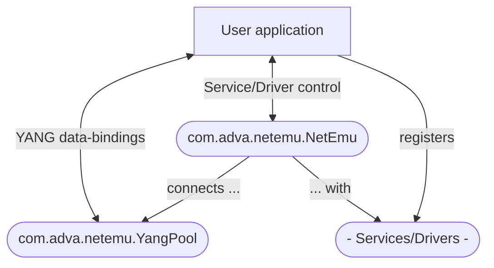

NETEMU
======


> **NE**tworking **T**echnologies' **E**nhanced **M**anagement **U**tilities

[ADVAnced](https://adva.com) Java/YANG **Rapid Development Framework for Lightweight SDN Applications**, featuring:

  * [OpenDaylight](https://www.opendaylight.org) libraries at its core
  * MD-SAL/ADVAnced code generation from YANG models using Java annotations
  * Clean, declarative, event-based, functional, asynchronous APIs for YANG-bound data flow
  * [CPython](https://www.python.org)-integration via [Jep](https://pypi.org/project/jep) for interactive data analysis and automation scripting, including support for [Jupyter](https://jupyter.org) notebooks
  * [React/Native](https://reactnative.dev)-integration with focus on [Expo](https://expo.io) for Android/iOS/Web cross-platform frontend development
  * Completely [Gradle](https://gradle.org)-managed application life-cycles

### Prepare your development environment for NETEMU

Make sure to have OpenJDK 11 or 13, Gradle 6.0+, [Groovy](https://groovy-lang.org) 3.0+, and [Maven](https://maven.apache.org) 3.6+ installed. Recommended installation sources are:

  * **GNU/Linux**: Your GNU/Linux distribution's package manager or [SDKMAN!](https://sdkman.io)
  * **Mac OSX**: [Homebrew](https://brew.sh) or [SDKMAN!](https://sdkman.io)
  * **Windows**: [Chocolatey](https://chocolatey.org)

> NETEMU DOES NOT fully work with Java 15 yet

[Intellij IDEA](https://www.jetbrains.com/idea) is NETEMU's preferred IDE. It has great Gradle integration, and its auto-completion works fast and smoothly with dynamic MD-SAL/ADVAnced code generation. If you prefer a terminal shell for managing your project, you should open a new terminal now and check your compiler and build tool versions again:

```shell
> java -version
openjdk 13.0.2 2020-01-14
...
```

```shell
> gradle -version
------------------------------------------------------------
Gradle 6.2.1
------------------------------------------------------------
...
```

```shell
> groovy -version
Groovy Version: 3.0.6 JVM: 13.0.2 Vendor: Oracle Corporation OS: Windows 10
```

```shell
> mvn -version
Apache Maven 3.6.2 (40f52333136460af0dc0d7232c0dc0bcf0d9e117; 2019-08-27T17:06:16+02:00)
...
```

If any `-version` output differs from what you expect, if it shows older, previously installed versions of a tool or of the Java installation it uses, the reason is usually one or more of the following:

  * The shell environment of a package manager was not properly activated
  * The `PATH` environment variable was not properly updated by an installer
  * The `JAVA_HOME` environment variable points to another Java installation

### Setup your local NETEMU

`git clone` the `netemu` repository using the `--recurse-submodules` flag. This will automatically clone along ADVAnced forks of OpenDaylight Git repositories to respective `opendaylight-*/` sub-folders and checkout their `adva/master` branches:

```shell
> git clone git@gitlab.rd.advaoptical.com:AT/anden/netemu.git --recurse-submodules
Cloning into 'netemu'...
...
Cloning into '.../netemu/opendaylight-mdsal'...
Cloning into '.../netemu/opendaylight-netconf'...
Cloning into '.../netemu/opendaylight-yangtools'...
Submodule path 'opendaylight-mdsal': checked out '...'
Submodule path 'opendaylight-netconf': checked out '...'
Submodule path 'opendaylight-yangtools': checked out '...'
```

> IF YOU FORGOT the `--recurse-submodules` flag, then you run the following from inside your cloned `netemu` repository's root directory:

```shell
> git submodule update --init --recursive
...
Cloning into '.../opendaylight-mdsal'...
Cloning into '.../opendaylight-netconf'...
Cloning into '.../opendaylight-yangtools'...
Submodule path 'opendaylight-mdsal': checked out '...'
Submodule path 'opendaylight-netconf': checked out '...'
Submodule path 'opendaylight-yangtools': checked out '...'
```

NETEMU requires slight ADVAncements in some method implementations of a few OpenDaylight modules. Hence the forked repositories. These modules must be installed first, using a convenient Gradle task, again from the `netemu` root directory:

```shell
> gradle mvnInstallOpenDaylightModules
...
Task :mvnInstallYangDataUtil
[INFO] Scanning for projects...
[INFO]
[INFO] ------------------------------------------------------------------------
[INFO] Building yang-data-util 5.0.7_1-ADVA
[INFO] ------------------------------------------------------------------------
...
Task :mvnInstallYangDataCodecXml
[INFO] Scanning for projects...
[INFO]
[INFO] ------------------------------------------------------------------------
[INFO] Building yang-data-codec-xml 5.0.7_1-ADVA
[INFO] ------------------------------------------------------------------------
...
Task :mvnInstallNetconfNettyUtil
[INFO] Scanning for projects...
[INFO]
[INFO] ------------------------------------------------------------------------
[INFO] Building netconf-netty-util 1.9.1_1-ADVA
[INFO] ------------------------------------------------------------------------
...
```

Then, the NETEMU Java package itself can be installed using Gradle task `:publishToMavenLocal` (_shortcut_ `pTML`) from integrated [Maven Publish Plugin](https://docs.gradle.org/current/userguide/publishing_maven.html):

```shell
> gradle publishToMavenLocal
...
Task :compileJava
...
BUILD SUCCESSFUL in ...
10 actionable tasks: 10 executed
```

Everything is ready for starting your first EMU-Project or building, running, and contributing to existing EMU-Projects!

### Before you start coding... a quick NETMEU API overview



**Services** are derived from abstract `com.adva.netemu.service.EmuService`. Predefined are:

* `com.adva.netemu.northbound.NetconfService` - Based on [OpenDaylight-netconf](https://github.com/opendaylight/netconf/tree/master/netconf)
* `com.adva.netemu.northbound.RestconfService` - Based on [OpenDaylight-restconf](https://github.com/opendaylight/netconf/tree/master/restconf) and [Grizzly](https://javaee.github.io/grizzly)

**Python** services are derived from abstract `com.adva.netemu.service.EmuPythonService` - Based on [Jep](https://pypi.org/project/jep); derived from `.EmuService`. Predefined is:

* `com.adva.netemu.northbound.PythonKernelService` - Using [IPython Kernel for Jupyter](https://github.com/ipython/ipykernel)

**Drivers** are derived from abstract `com.adva.netemu.driver.EmuDriver`. Predefined is:

* `com.adva.netemu.southbound.NetconfDriver` - Based on OpenDaylight-netconf

### If you come from Netopeer2/sysrepo... or don't

NETEMU's API design draws heavily from the modular structure of [CESNET's C libraries and tools](https://github.com/cesnet) for NETCONF/YANG application development, whose main components are:

* [sysrepo](https://github.com/sysrepo) - A central YANG datastore and module repository service
* sysrepo-client - A library for developing applications that communicate over sockets with the sysrepo service for reading and writing data and reacting to data request and change events
* [Netopeer2](https://github.com/CESNET/netopeer2) - A standalone sysrepo-client application that implements a northbound NETCONF service

Although NETEMU follows a monolithic application approach without any inter-process communication, its essential classes can be directly feature-mapped to CESNET components:


### Start your first EMU-Project
